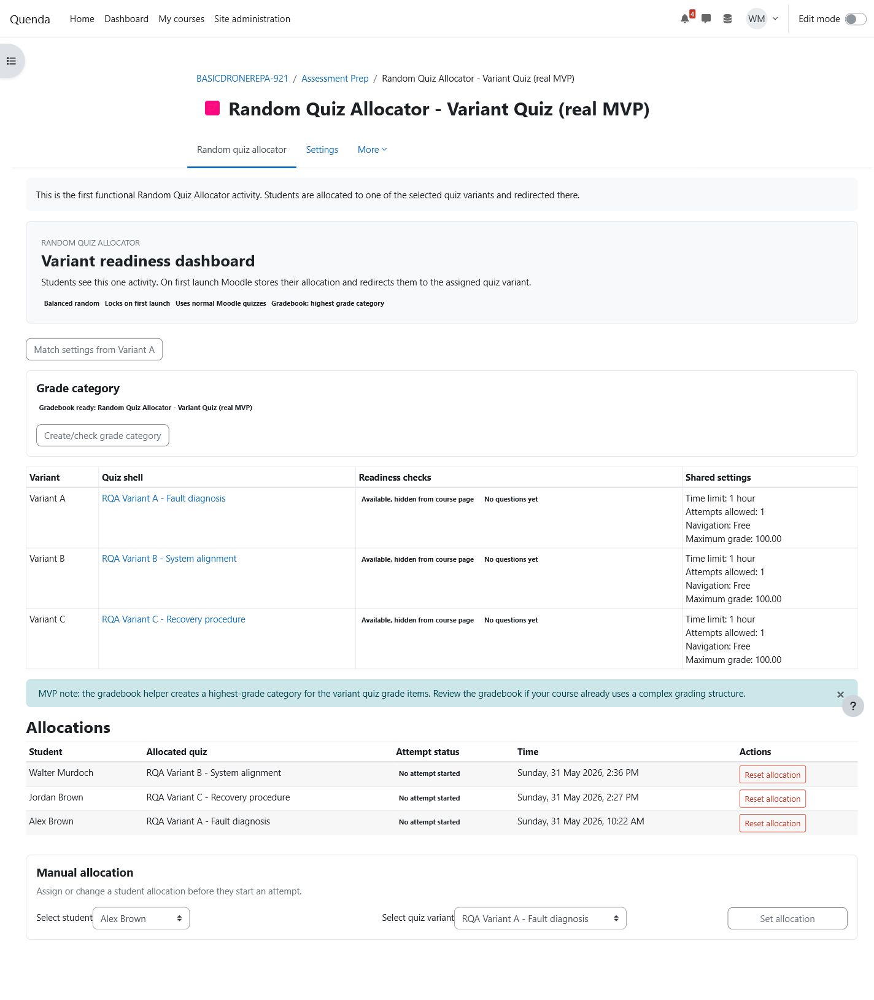
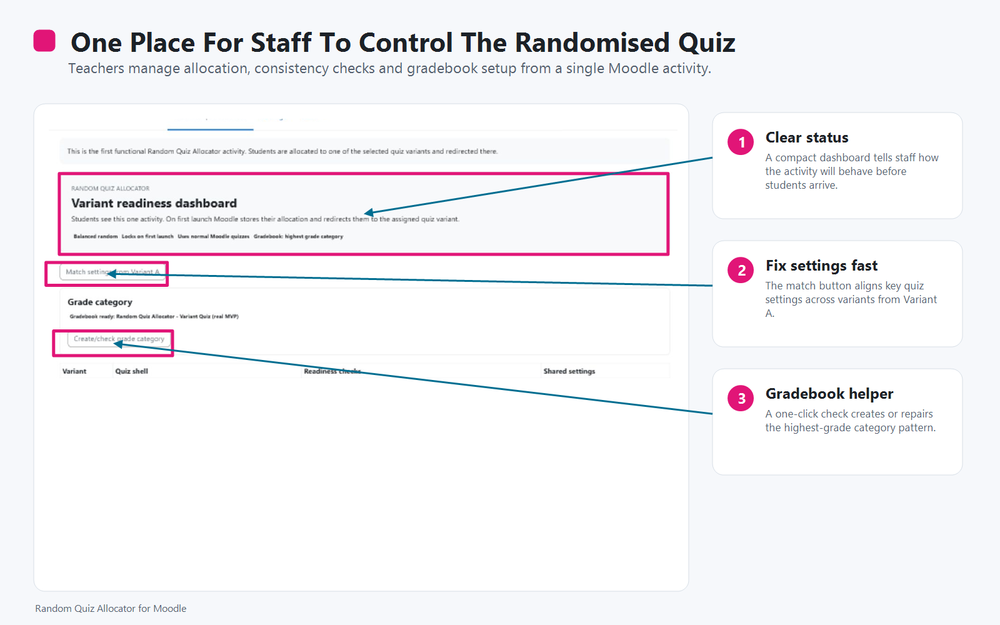
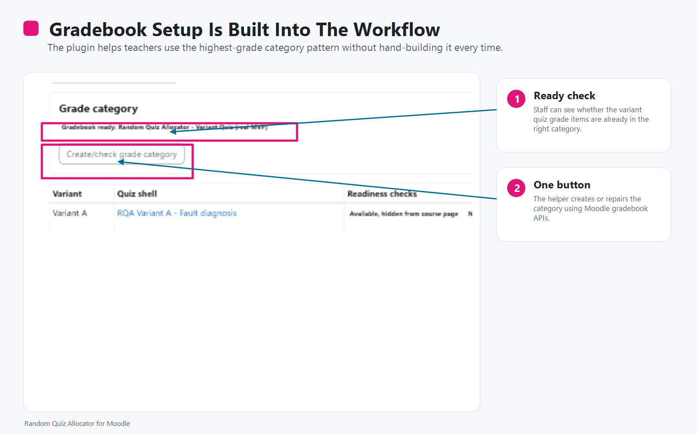
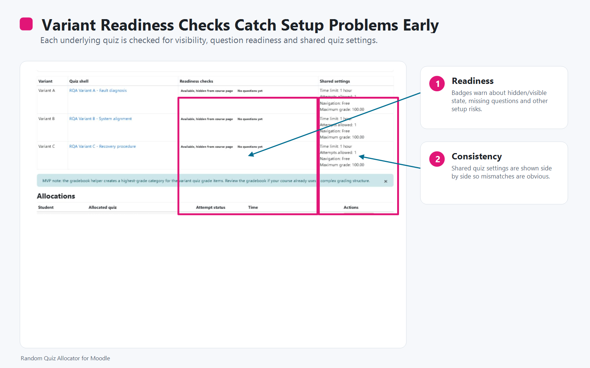
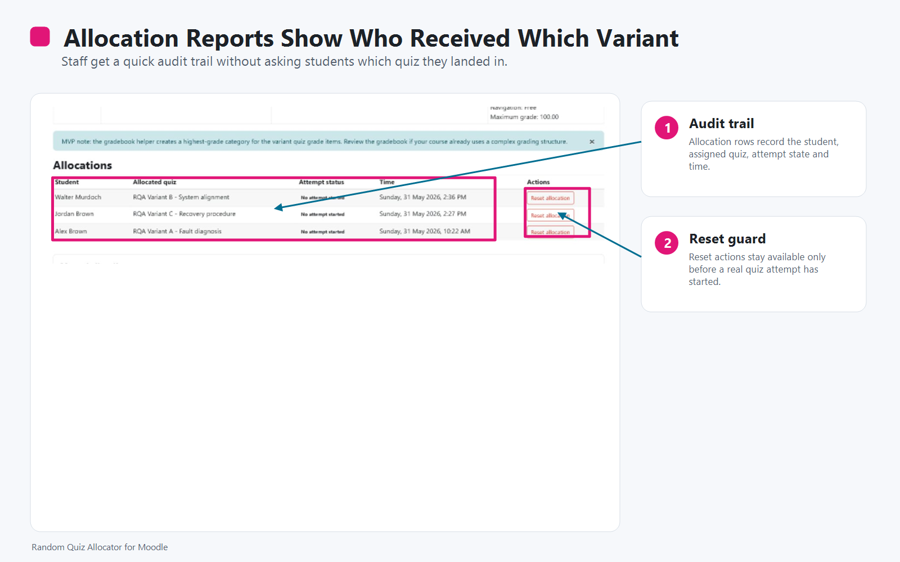
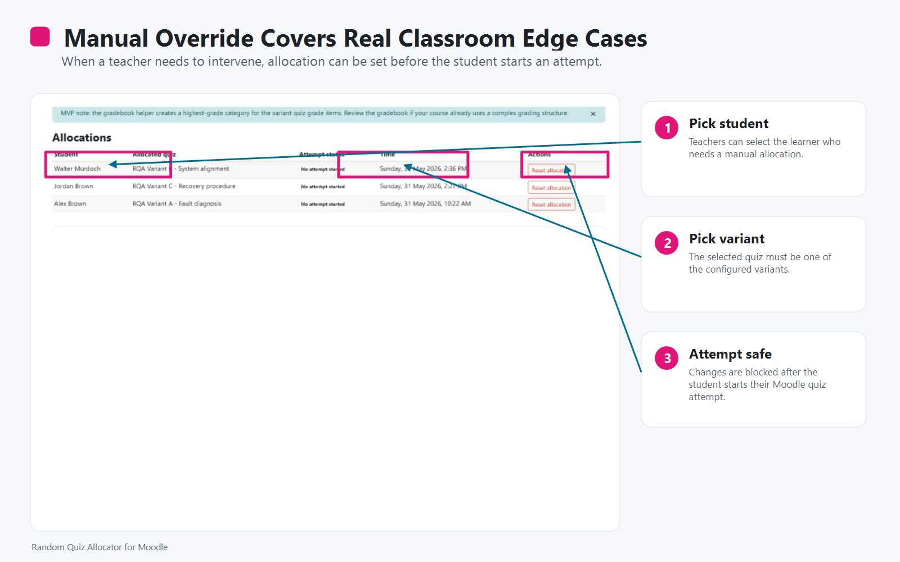
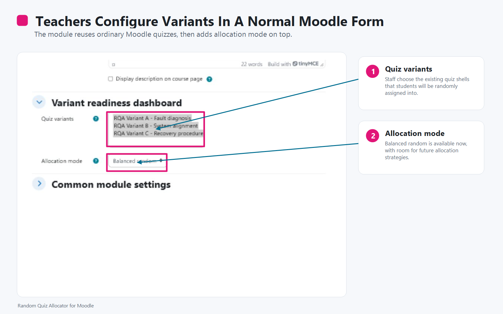
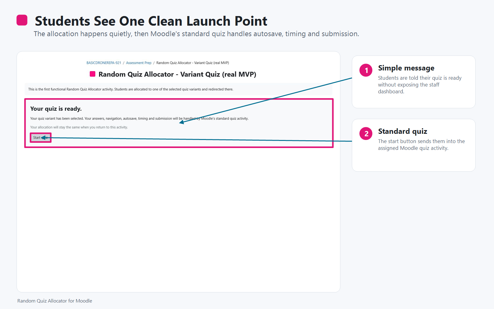

# Random Quiz Allocator

`mod_randomquiz` is a Moodle activity module that allocates each student to one quiz from a teacher-selected pool of existing Moodle quiz activities.

The plugin is designed for situations where staff need to randomise whole quiz variants rather than individual questions from a question bank. Each variant remains a normal Moodle quiz, so Moodle's existing quiz attempt handling, navigation, autosave, timing, submission, grading and review behaviour are preserved.

## Current MVP Features

- Create a Random Quiz Allocator activity in a course.
- Select two or more existing quiz activities as variants.
- Allocate students using either:
  - balanced random allocation
  - random allocation
- Store one allocation per student.
- Show students a launch page before they enter the assigned Moodle quiz.
- Show a teacher dashboard with variant readiness checks.
- Warn when quiz variants differ on key settings.
- Match safe quiz settings from Variant A to the other variants.
- Create/check a gradebook category using Highest grade aggregation.
- Show allocation reports.
- Reset allocations before a student starts the assigned quiz.
- Lock allocation reset once a non-preview quiz attempt exists.
- Manually assign or change a student allocation before they start an attempt.
- Basic Moodle backup/restore support for instances, variants and allocations when the referenced quiz activities are included in the same restore.

## Screenshots

## Product Brief

For the concept, requirements, use cases and developer questions, see [Random Quiz Allocator Product Brief](docs/random-quiz-allocator-product-brief.md).

For the response to the June 2026 external security review, see [Security Review Response](docs/security-review-response-2026-06-12.md).

## Recommended Course Setup

1. Create the individual Moodle quizzes that should act as variants.
2. Add the required questions to each quiz.
3. Set each variant quiz to be available but hidden from the course page.
4. Add a Random Quiz Allocator activity.
5. Select the variant quizzes.
6. Use **Match settings from Variant A** to align shared quiz settings.
7. Use **Create/check grade category** to place variant quiz grade items into a Highest grade category.

## Moodle 5.1 Notes

Moodle 5.1 moved web-facing plugin code into the `public` directory. On Moodle 5.1+, install this activity at:

`public/mod/randomquiz`

For Moodle 4.5-style layouts, install it at:

`mod/randomquiz`

The plugin declares `FEATURE_MOD_PURPOSE` as Assessment and, on Moodle versions that support it, declares Administration as a secondary activity purpose.

## Notes

- The allocator does not replace Moodle quiz attempts. It only chooses which Moodle quiz a student receives.
- The student launch page links students into the normal Moodle quiz page.
- The reset action only removes an allocation if the student has not started a real attempt.
- Variant quiz grade items are not hidden automatically.

## Known Limitations

- Backup/restore support is new and should be tested across course copy and restore workflows. Standalone activity backups do not include the referenced quiz activities by themselves.
- Privacy support exports and deletes allocation data, but should be reviewed before production release.
- Mismatch labels cover the main quiz settings only.
- Manual allocation uses a simple enrolled-user selector; larger sites may want autocomplete/search before production release.
- There are no automated tests yet.

## Development Status

Alpha / local testing.
